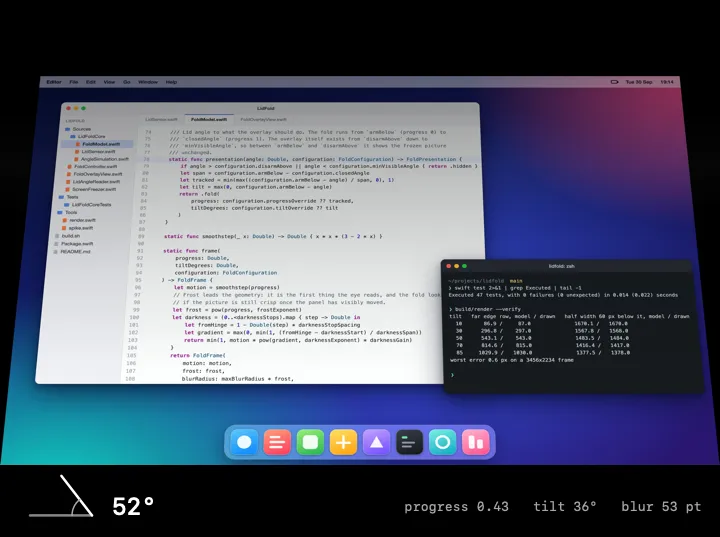
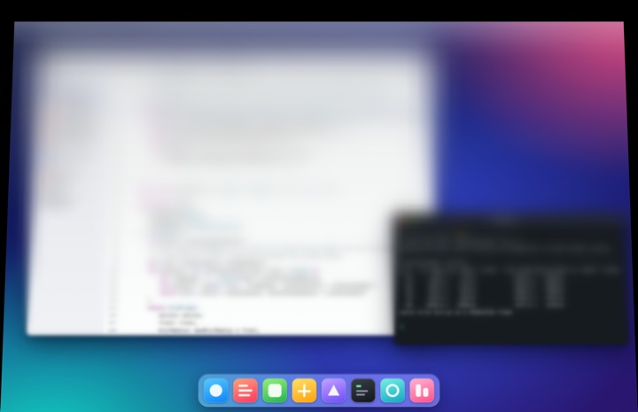
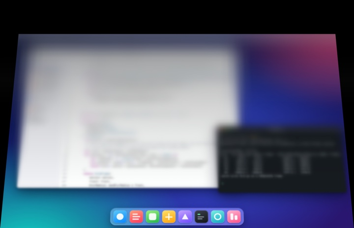
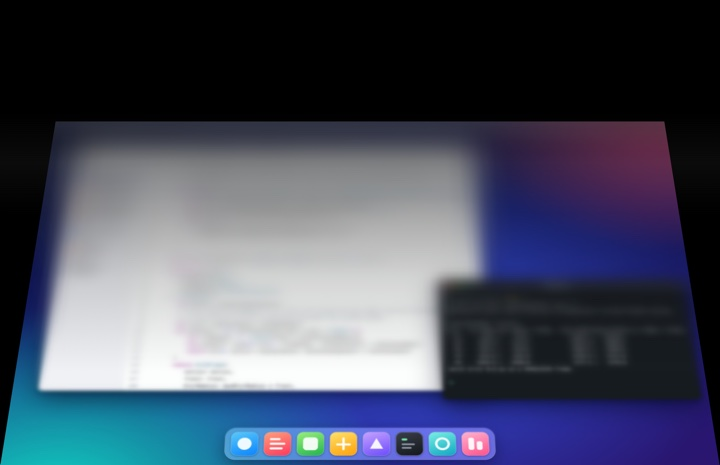
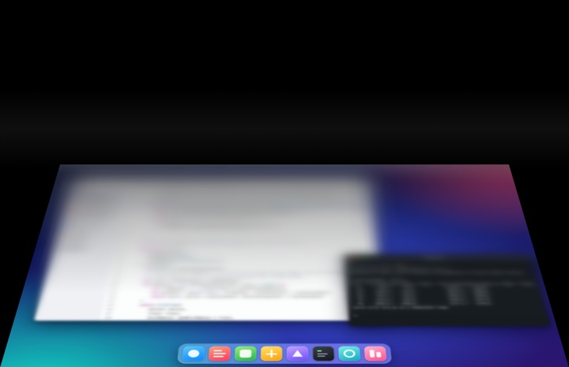

# LidFold

The iPhone Duo fold animation on a MacBook, driven one to one by the real lid angle sensor.

<p align="center">
  
</p>

<sub>Frames drawn by the app's own overlay view from a generated stand-in desktop (Tools/standin), with a scripted
lid sweeping 100° to 5° and back. A rendered sequence, not a screen recording of a live desktop.</sub>

Close the lid and the built-in display freezes, swings away about the hinge into a foreshortened trapezoid,
and frosts with a progressive blur as black void opens behind it. The hinge is the scrubber: there is no
timeline, so reverse the lid halfway and the fold reverses with it.

- The fold starts below 88° and is complete at 5°. The overlay is gone above 90°, so a normal working angle
  (97° to 103° on the test machine) never triggers it.
- Built-in display only. Nothing renders on external monitors.
- Swift, AppKit, IOKit HID and Core Animation: 671 lines of app code, 459 of tests, no dependencies.

## Run it

```sh
./build.sh      # build/LidFold.app, ad-hoc signed, about 10 s
./run.sh        # from a terminal that already has Screen Recording, then close the lid slowly
```

Needs an Apple silicon MacBook with the lid angle sensor (checked on a 16-inch MacBook Pro with M1 Pro, others
not tested) and the Xcode command line tools. It builds for macOS 14 and has only been run on 26.5.2 and 27.0.
Run it from a terminal that holds Screen Recording: macOS then attributes the screen capture to the terminal
and the ad-hoc signed app never prompts.

No lid to move? `LIDFOLD_SIMULATE=100:5:3:0.5 ./run.sh` replays a scripted lid: 100° to 5° in 3 s,
half a second of pause, and back, forever. The menu bar item says "simulated", and Ctrl-C in the terminal stops it.
`./build.sh install` stops a running copy and installs the app to /Applications.

## How it works

### Reading the lid angle

```
IOHIDManager ─ matches ─► built-in sensor hub (product "las", transport SPU)
                          vendor 0x05AC, product 0x8104, usage page 0x20, usage 0x8A
IOHIDDeviceGetReport(feature, report ID 1) ─► 3 bytes [01, lo, hi]
angle = (lo | hi << 8) & 0x1FF                  a 9-bit field, 0 to 360
```

- One device matches and it opens with `kIOHIDOptionsTypeNone`, which needs no Input Monitoring permission. On
  the test machine a report reads `01 67 00`, which is 103°. A shut lid reads 0.
- The field is 9 bits wide with a range of 0 to 360, read as whole degrees. The report descriptor declares
  it that way, but I could not move the lid during the measurements, so the step size is not verified by motion.
- It is polled, not subscribed to. A dispatch timer fires every 16 ms with 2 ms leeway. Measured over 30 s:
  1875 reads, none failed, mean interval 16.0 ms (62.5 Hz), p95 19.1 ms. One read takes 0.66 ms at the
  median and 1.4 ms at p95.
- Above 90° nothing is drawn, so the sensor is polled every sixth tick, about 10 times a second.
- The reading goes through an exponential average with weight 0.4 per sample: a time constant of 33 ms at
  60 Hz, and 90% of a step after 5 samples.

### The fold model

`progress` runs from 0 at 88° to 1 at 5°. Everything the overlay draws is a function of it.

| Lid angle | Fold | Tilt | Blur radius | Far edge width | Far edge height |
|---|---|---|---|---|---|
| 100° | overlay off | | | | |
| 90° | 0.00 | 0.0° | 0 pt | 100% | 100% |
| 88° | 0.00 | 0.0° | 0 pt | 100% | 100% |
| 75° | 0.16 | 13.0° | 26 pt | 96% | 95% |
| 55° | 0.40 | 33.0° | 50 pt | 90% | 85% |
| 35° | 0.64 | 53.0° | 70 pt | 85% | 74% |
| 15° | 0.88 | 73.0° | 88 pt | 81% | 62% |
| 5° | 1.00 | 83.0° | 96 pt | 79% | 55% |

`build/render --table 100,90,88,75,55,35,15,5` prints this from the model. Far edge is the top of the screen
as a fraction of the hinge edge's width and of the panel height.

- **Geometry.** The picture rotates about the hinge by 0.55 degrees per degree of lid travel (45.7° at full
  fold) under a perspective camera 3000 pt away. The far edge shrinks toward the hinge and black void opens
  above it.
- **Blur.** One private `variableBlur` filter, radius `96 pt * progress^0.7`, with a mask that grows with the
  distance from the hinge as `d^1.35`. The blur leads the geometry on purpose: the fold looks empty if the
  picture is still crisp once the panel has visibly moved.
- **Darkening.** A six-stop black gradient, alpha `min(1, 1.5 * smoothstep(progress) * clamp((d - 0.2) / 0.8)^1.35)`.
  The top two stops are solid black at full fold. A faint glass tint (0.20) and reflection band (0.06) ride on top.

<table>
  <tr>
    <td></td>
    <td></td>
  </tr>
  <tr>
    <td align="center">75°: the top edge starts to recede</td>
    <td align="center">55°: blur is already heavy, geometry follows</td>
  </tr>
  <tr>
    <td></td>
    <td></td>
  </tr>
  <tr>
    <td align="center">35°: void opens above the picture</td>
    <td align="center">5°: fully folded, only the hinge edge is sharp</td>
  </tr>
</table>

The model is checked against the renderer, not just against itself. `build/render --verify` swings a flat
picture through Core Animation at five tilts and compares the far edge row and the width below it with the
trigonometry in `FoldModel.silhouette`: worst difference 0.6 px on a 3456 x 2234 frame.

### Frame pacing

Two clocks that are not locked to each other, joined by a hand-off to the main thread:

```
 sensor queue                     main thread                              window server
 16 ms timer                      1/60 s timer
 read, decode, smooth  ───────►   FoldModel.presentation   ───────────►   composites the
 (AngleFilter)        main.async  view.update, one CATransaction          layer tree
```

- The main thread's per-tick work is one `CATransaction` that sets a transform, a blur radius, six gradient
  colours and two opacities: 15 µs at the median, 26 µs at p95 (3000 calls).
- A full retina frame of the layer tree, blur included, costs 4.0 ms at the median and 8.3 ms at p95 when drawn
  offscreen on the M1 Pro (300 frames that all differ). That fits the 16.7 ms tick with room to spare. It is
  `CARenderer` into a Metal texture, not the window server's compositor, so it measures the cost of a frame,
  not what the screen shows.
- The 1/60 s main-thread timer runs whether or not the overlay is showing. With a simulated open lid (so no
  overlay and no IOKit reads) `top` showed the app at 0.2 to 0.6% CPU over three 2 s samples. Starting that timer
  only when the lid drops below 90° would save most of it. I left it alone because I could not test the live
  overlay to check the change.
- Neither timer is phase-locked to the display. `NSView.displayLink` (macOS 14) would tie the update to the
  panel's refresh. I did not try it.
- Latency is derived, not measured end to end, because that needs a lid moving at a known speed. The worst
  case from lid to layer tree is one sensor tick plus one UI tick, 18 ms + 16.7 ms, then the next compositor
  frame. The smoothing adds a steady lag of 1.5 samples (25 ms) on a moving lid.

All raw output, machine and load are in [docs/measurements.md](docs/measurements.md). The laptop was shared with
other heavy work, so the tails are pessimistic.

## Decisions and what they cost

1. **Freeze a capture instead of blurring the live desktop.** A backdrop layer samples in screen space: a
   transform moves where its effect lands but never warps the pixels it sampled, so a foreshortened
   trapezoid needs real pixels. The cost is a Screen Recording grant, a picture that is a still (video
   and animation on screen look frozen until the fold ends), and one capture each time the lid passes 90°.
2. **A private blur filter.** No public API gives a blur radius that varies down the screen, and the build
   machine has no Metal toolchain installed (`xcrun metal` fails), so a custom shader was not an option.
   `CAFilter` `variableBlur` does it in one filter. The cost is a private API that any macOS update can break
   and that rules out the App Store. It still resolves on macOS 27.0: the offscreen render applies it.
3. **Maths as pure functions in a small core.** Decode, smoothing, poll throttle, angle to fold and every curve
   live in `Sources/LidFoldCore` with no AppKit, so the tests need no display and no lid. The cost is two build
   paths: SwiftPM builds the core for `swift test`, `build.sh` compiles the same files into the app.
4. **Polling the sensor.** One synchronous call per tick gives a cadence that can be measured and a failure
   that is visible. The cost is about 62 sensor-queue wake-ups a second while the lid is below 90°. I did not try the
   sensor's input report path.

## Status and limits

- Verified on one machine, a MacBookPro18,1 on macOS 27.0: sensor read, all tests, the offscreen render and
  the build. The tests, the builds and `build/render --verify` (0.6 px again) also pass on GitHub's macOS 15 and
  macOS 26 runners, so the private blur filter resolves there too.
- **Not verified in this pass:** the live overlay (ScreenCaptureKit freeze, full-screen window, real lid). The
  author ran it on macOS 26.5.2 (per CLAUDE.md). His app log, `~/Library/Logs/lidfold.log`, has overlay lines
  from 11 to 13 Sep 2026, and a unit test replays 24 of them; the log says nothing about how the lid was moved.
  Running the overlay now would cover the display and needs Screen Recording.
- Not verified: other MacBook models, the sensor's step size by motion, and the lid-to-glass latency.
- There is no signing identity, so every build is ad-hoc signed and a launch from Finder or launchd is a new
  app to macOS each time. That is why `run.sh` exists. When a capture fails the app retries every 5 s and can
  re-prompt.

## Tests and tooling

```sh
swift test                              # 47 tests, about 0.01 s
./build.sh render && build/render --verify
```

The tests cover the report decode, the smoothing and its step response, the stale flag and the poll throttle,
the angle to fold mapping (including 24 angle and progress pairs copied unchanged from the app's own log on the
author's machine), each fold curve against values computed by hand, the blur mask, the silhouette, the scripted
lid, and a scripted close run end to end through the filter and the decision. CI runs the same commands on
macOS 15 (Swift 6.1.2) and macOS 26 (Swift 6.3.3) runners.

| Tool | What it does |
|---|---|
| `build/spike [seconds]` | Reads the sensor like the app does, prints each change, then the rate and the read latency. |
| `build/render` | Draws the real overlay view offscreen: `--angles`, `--simulate`, `--verify`, `--bench`, `--table`. |
| `Tools/hero.sh` | Regenerates the media in `docs/` from `Tools/standin/desktop.jpg`. |
| `Tools/check-refactor.sh` | Draws eight lid angles with the overlay view from before the core was extracted (commit 78f7bae) and with today's, and compares the PNGs byte for byte. Needs the full git history. |

`CLAUDE.md` holds the field notes: the traps that each cost a rebuild, the dev overrides and the layout.

## Credit

Sensor reverse engineering: [LidAngleSensor](https://github.com/samhenrigold/LidAngleSensor),
[pybooklid](https://github.com/tcsenpai/pybooklid). Fold maths read from
[macTilt](https://github.com/lqSky7/iphone-duo-macos-animation) and
[iphone-duo](https://github.com/chuspeeism/iphone-duo).
